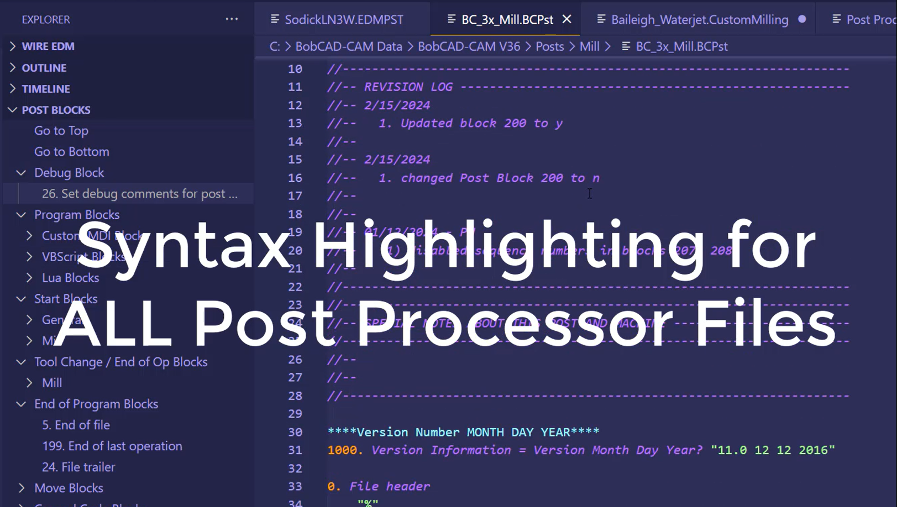

# BobCAD-CAM Post Processor Utility

Welcome to the BobCAD-CAM Post Processor Utility, your ultimate tool for streamlining and enhancing your post processor workflow in CNC machining. This powerful extension for Visual Studio Code brings the power of BobCAD-CAM's post-processing capabilities right into your favorite editor. With features like syntax highlighting, code snippet completion, and a tree viewer for post blocks, this utility makes it easier than ever to work with .bcpst files. Whether you're a seasoned CNC programmer or just getting started, the BobCAD-CAM Post Processor Utility is an indispensable tool for your CNC programming needs.

## Features

* Syntax Highlighting for all BobCAD-CAM Post Processors File Extensions
* AutoCompletion and Code Snippets
* Formatter (SHIFT + ALT + F)
* Post Blocks Tree Viewer
* Shortcut for debug_on/off (CTRL + ALT + D)
* Append Revision Log Command
* Go to Program Block (CTRL + Click on porgam_block_# or lua_block_#)
* Open Help Systems Directly in VSCode
* Post Block Information on Hover
* Go to Post Block Command

## Demo

CLICK TO WATCH!

> Tip: Watch the demo video closely to understand the extension's features and operations. Don't hesitate to pause and replay sections for clarity. This will help you maximize the utility of the BobCAD-CAM Post Processor.

## Release Notes

### 1.0.0

The new BobCAD-CAM Post Processor Utility extension is packed with exciting features! This version extension introduces a host of new features, including enhanced syntax highlighting for BobCAD-CAM specific files, advanced code snippet completion, a tree viewer for easy navigation of post blocks, and improved support for Lua and VBScript blocks.

**Enjoy!**
